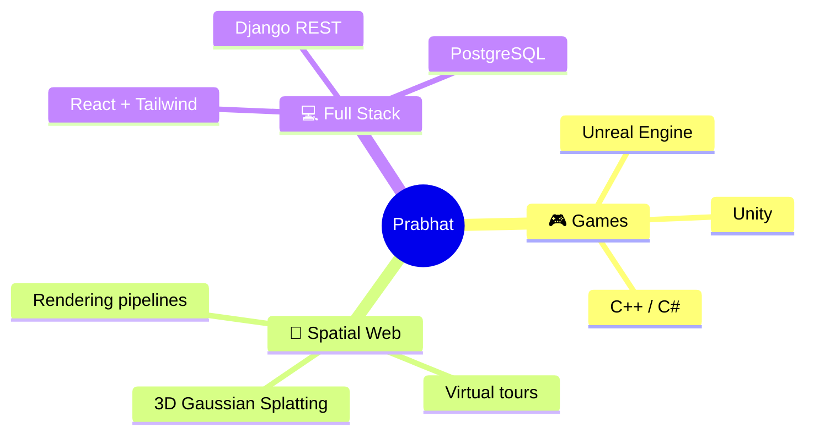

<i>Pushing the boundaries of 3d-spatial computing, photorealistic rendering, and interactive web experiences from Nepal 🇳🇵</i>

  
  

<h3>🌐 Connect With Me</h3>

  

### 👾 What I Do

- 🔭 I’m currently engineering solutions for a **3D Gaussian Splatting (3DGS) platform**, bringing high-fidelity volumetric scenes to life.
- 🕹️ Building games and interactive experiences using **Unreal Engine**.
- 💻 Creating seamless, responsive user interfaces as a **Frontend Developer**.
- 💬 Ask me about: **Game architectures, 3D rendering pipelines, React, C++, and Backend integrations.**
- 📫 Reach out at: **[prabhatbhusal777@gmail.com](mailto:prabhatbhusal777@gmail.com)**

<h3>🛠️ Tech Stack & Arsenal</h3>

<b>🎮 Game Engines & 3D Core</b>

  

<b>💻 Frontend & UI Development</b>

  

<b>⚙️ Backend, Database & Tools</b>

### 🚀 Featured Projects

<!-- Add more pins by copying the line above and changing repo=<RepoName> -->

### 🐍 GitHub Contribution Snake

  <picture>
    <source media="(prefers-color-scheme: dark)" srcset="https://raw.githubusercontent.com/prabhatbhusal/prabhatbhusal/output/github-contribution-grid-snake-dark.svg">
    <source media="(prefers-color-scheme: light)" srcset="https://raw.githubusercontent.com/prabhatbhusal/prabhatbhusal/output/github-contribution-grid-snake.svg">
    
  </picture>

### 📊 GitHub Analytics

